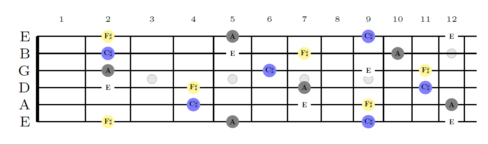
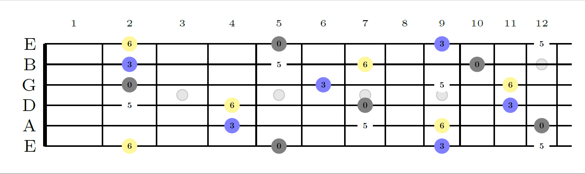

# Deep Guitarist [](https://travis-ci.org/yuma-m/pychord) [](http://pychord.readthedocs.io/en/latest/?badge=latest)


## Overview

Deepguitarist is a python library to handle chords, scales, fretboards, their visualizations, and AI song writing on guitar.

## Installation

```sh
$ pip install pychord
```

## Basic Usage

### Create a Chord

```python
>>> from pychord import Chord
>>> c = Chord("Am7")
>>> c
<Chord: Am7>
>>> c.info()
"""
Am7
root=A
quality=m7
appended=[]
on=None
"""
```

### Transpose a Chord

```python
>>> c = Chord("Am7/G")
>>> c.transpose(3)
>>> c
<Chord: Cm7/Bb>
```

### Get component notes

```python
>>> c = Chord("Am7")
>>> c.components()
['A', 'C', 'E', 'G']
```

### Compare Chords

```python
>>> Chord("C") == Chord("D")
False
>>> Chord("C#") == Chord("Db")
True
>>> c = Chord("C")
>>> c.transpose(2)
>>> c == Chord("D")
True
```

### Find Chords

```python
>>> from pychord import note_to_chord
>>> note_to_chord(["C", "E", "G"])
[<Chord: C>]
>>> note_to_chord(["F#", "A", "C", "D"])
[<Chord: D7/F#>]
>>> note_to_chord(["F", "G", "C"])
[<Chord: Fsus2>, <Chord: Csus4/F>]
```

### Create and handle chord progressions

```python
>>> from pychord import ChordProgression
>>> cp = ChordProgression(["C", "G/B", "Am"])
>>> cp
<ChordProgression: C | G/B | Am>

>>> cp.append("Em/G")
>>> cp
<ChordProgression: C | G/B | Am | Em/G>

>>> cp.transpose(+3)
>>> cp
<ChordProgression: Eb | Bb/D | Cm | Gm/Bb>

>>> cp[1]
<Chord: Bb/D>
```

## Advanced Usage

### Create note/chord/scale graphs on a fretboard with given tuning
```python
>>>from pychord import Fretboard, Chord, Scale
>>>ST = Fretboard('standard', 12)
>>>ST.texify(Chord('A6'))
```

```python
>>>ST.texify(Chord('A6'), 'degree')
```


### Create a Chord from note index in a scale

```python
>>> Chord.from_note_index(note=1, quality="", scale="Cmaj")
<Chord: C>  # I of C major
>>> Chord.from_note_index(note=3, quality="m7", scale="Fmaj")
<Chord: Am7>  # IIIm7 of F major
>>> Chord.from_note_index(note=5, quality="7", scale="Amin")
<Chord: E7>  # V7 of A minor
```

## Supported Python Versions

- 2.7
- 3.4 and above

## Links

- GitHub: https://github.com/yuma-m/pychord

## Author

- [Waerden](https://www.math.columbia.edu/~tedd2013/)

## License

- MIT License

